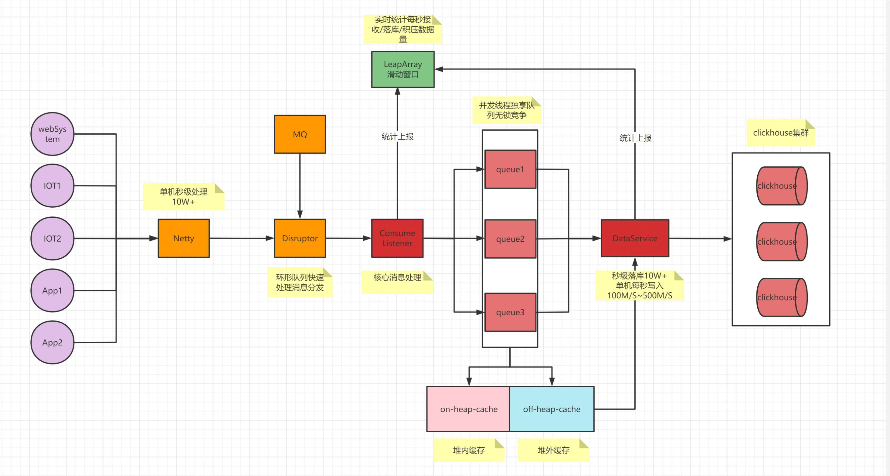

# flowback

## 项目简介
flowback
亿级消息落库,低成本秒级百兆消息落库方案(单机秒级处理100M/s~300M/s)

亿级数据检索秒级响应,单机秒级落库处理10w+数据,集群可叠加性能

高压缩率的存储节省磁盘空间1GB数据只需要原来的80%~90%存储甚至更低

原本需要接收1GB的数据压缩后只需要200M来传递是原来的1/4，从而节省带宽

适用于大数据落库需求、网关日志收集、各类日志收集、物联网设备数据收集、游戏/app埋点数据收集、大量数据收集统计需求
等等..

## 功能
* 秒级统计监控实时接收消息，实时落库消息，实时堆积消息
* 支持集群clickhouse
* 支持从直接从消息队列直接消费消息，无需入侵性（目前支持rabbitmq更多mq中间件后续可支持）
* 后台实时看版（后续支持）

## 架构图

## 设计关键要点

* 使用堆内外缓存方式大量减少GC带来的影响
* Netty作为高性能通信服务使用TCP方式保证消息可靠
* 使用Disruptor缓冲流转消息与多级BlockingQueue组成无锁竞争双缓冲队列
* Clickhouse作为高性能OLAP仓库,活跃于大数据领域,亿级数据秒级响应,数据高压缩率是原数据的80%~90%
* 使用ZSTD压缩算法对消息进行压缩,原1GB只需要200M来传递,是原来的4-5倍
* 实时自动创建表结构拿来即用不需要关心建表问题(大数据量建议手动设计表)

## 核心使用技术

* Java 1.8

* SpringBoot  2.2.6

* Netty 4.1.23.Final

* OHC (off-heap-cache)

* Clickhouse

* FastJsoN

*Disruptor

## 性能压测

####采用腾讯云主机单机16核心32G，1T云盘，1 work端发送消息,1 server端接收消息落库16亿条消息耗时8小时

####系统资源监控
cpu,内存使用率平稳,磁盘平均写入130M/s

####JVM监控
持续8小时落库,堆整体使用率低平稳,堆使用仅有几百兆

##检索测试
####符合稀疏索引的匹配规则下从16亿数据随意输入匹配条件耗时

## 安装教程
1. 全新环境Centos7.9部署(自动安装docker,docker-compose)
    * 复制项目/readme/fb文件到目录到任意目录
    * 执行 chmod 777 start.sh
    * 执行 ./start.sh

2. docker & docker-compose 环境部署
    * 复制项目/readme/fb文件到目录到任意目录
    * 执行 docker-compose -f docker-compose-standalone.yaml  up -d 

## spring集成

1. maven client 依赖包（待完善提供）
2. 配置rabbitmq消息队列与队列名称（目前仅支持）
3. 复制work端代码配置，使用ProtocolUtils发送消息，参考WorkClientHandler

## 参考文献
* Netty相关知识

* http://www.52im.net/

* 京东秒级百G设计方案

* https://my.oschina.net/1Gk2fdm43/blog/5312538

* 京东秒级百G开源

* https://gitee.com/jd-platform-opensource/jlog?_from=gitee_search

* 压缩算法对比

* https://tech.meituan.com/2021/01/07/pack-gzip-zstd-lz4.html

* Clickhouse

* https://clickhouse.com/docs/zh/introduction/performance/

* OHC

* https://www.cnblogs.com/liang1101/p/13499781.html

## 开发工具

* IDEA

* https://www.jetbrains.com/zh-cn/idea/

* datagrip(数据库可视化工具
)

* https://www.jetbrains.com/datagrip

## 参与项目

热爱开源,热开编程.

共同进步++++++++++++++++++

